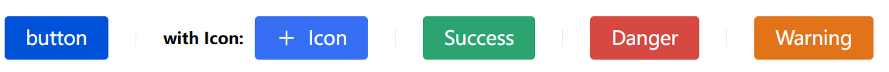
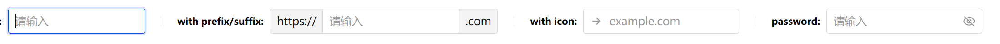
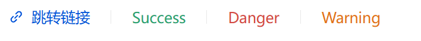
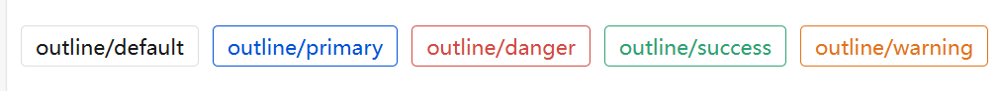
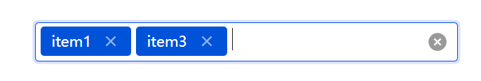
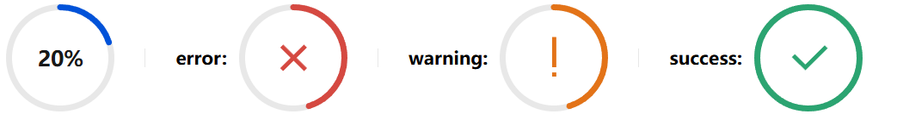

### NiceGoi
NiceGOI is an easy-to-use, Golang-based UI framework, which shows up in your web browser. You can create buttons,inputs,card and much more.

It is great for micro web apps,tools app.

##### run belong command to see demo:
```shell
go run github.com/yaoguangduan/nicegoi/cmd/nicegoi_demo@latest
```

##### Features
- write like native gui,use like web server
- browser-based graphical user interface
- standard GUI elements like label, button, checkbox, switch, slider, input

##### Usage

```go
package main

import (
	"github.com/yaoguangduan/nicegoi"
)

type Home struct {
}

func (t *Home) Name() string {
	return ""
}

func (t *Home) Layout(ctx nicegoi.PageContext) {
	input := ctx.Input(nil)
	btn := ctx.Button("Click Me!", func(self *nicegoi.Button) {
		is := input.GetValue()
		if is == "" {
			self.Ctx().MsgInfo("hello world")
		} else {
			self.Ctx().MsgSuccess("hello " + is)
		}
	})
	ctx.Box(input, btn).Vertical()
}

func main() {
	nicegoi.Run(new(Home))
}


```

##### Showcase

###### buttons

###### inputs

###### links

###### tags

###### tag-input

###### progress


###### add more...